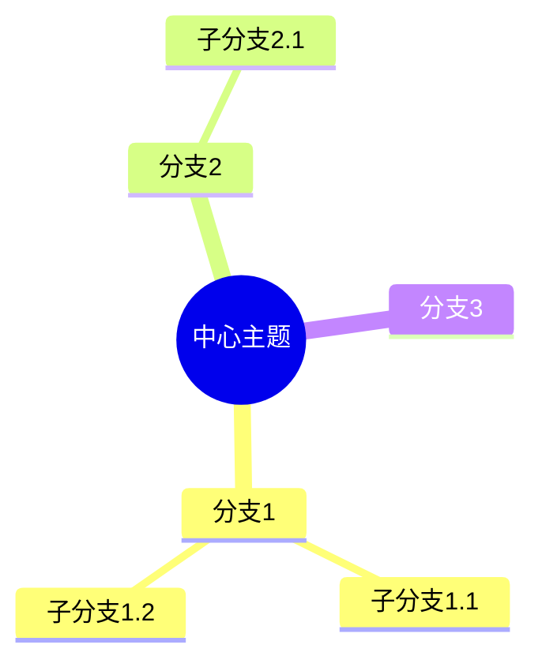

# Mindmap 思维导图参考

## 基本语法

```mermaid
mindmap
  root((中心主题))
    分支1
      子分支1.1
      子分支1.2
    分支2
      子分支2.1
    分支3
```

## 样式说明
- `((text))` - 圆形节点
- `[text]` - 方形节点
- `[[text]]` - 圆角方形节点
- `>text]` - 旗帜形节点
- `{text}` - 菱形节点
- `{{text}}` - 六边形节点
- 缩进表示层级关系
